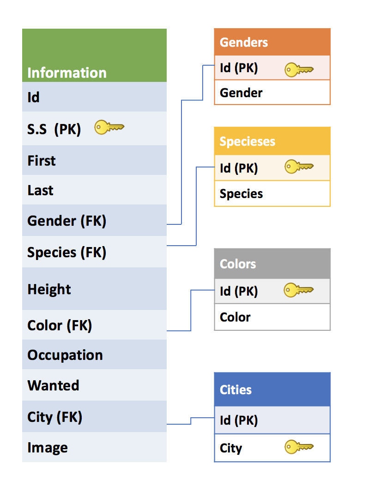

<a name="goback">

# Zootopia-API
## Live: https://zootopia-api.herokuapp.com/
</a>

## Table of Contents

1. [App description](#appdescription)
2. [User Stories](#userstories)
3. [Visual representation of the database](#database)
4. [Pseudocode](#pseudocode)
5. [Technologies used](#technologies)
6. [Ways to see the project](#project)

<a name="appdescription">

## APP DESCRIPTION:

Zootopia is an application for Zootopia Embassy that helps people who apply to renew their passport to track their passport renewal process.

### This project consists of three parts:

1.Zootopia API: 
This app works as Restful API to store all Zootopia citizens information and provide the embassy with detailed information on every citizen.
This API provides.

*	Basic CRUD (Create, Read, Update and Delete) with postman.

*	Cross-origin Resource Sharing using by using CORS middleware.

2.Embassy of Zootopia app
The embassy staff can transfer and store the information of the people who wants to renew their passport from Zootopia Database to the embassy local database.

Once the person is added to the local database, the embassy staff can add more information. 

3.Zootopia citizen APP:
a customized HTML template for the citizen of Zootopia to check the status of their passport renewal application.
a user by entering the social security number can find out where is his passport.


</a>

<a name="userstories">

## USER STORIES:

* As a user, I want to be able to view all the people’s information in the database 
* As a user, I want to be able to view one person’s information using social security number.
* As a user, I want to be able to add a person to the database through postman.
* As a user, I want to the social security number to be unique and get error message if I want to add person with social security number that is already exist. 
* As a user, I want to be able to change person’s information in the database through postman.
* As a user, I want to see the API instruction 

</a>

<a name="pseudocode">

## PSEUDOCODE:

### Creating Zootopia Government database 

*  Design tables, relations, primary keys and foreign keys for each table.
*  Create schema file 
*   seed the database using the schema file
*	Create government API using express and node.js with full crud functionality
	* 	Create: POST: add one citizen to the database using postman

 	*	Read: GET: get all citizens information or get one only by using the citizen’s social security number through the browser
	*	Update: PUT change one citizen’s information using postman
	*	Delete: DELETE one citizen from the database using social security number
</a>

<a name="database">

## ERD/VISUAL REPRESENTATION OF DATABASE:

</a>

<a name="technologies">

## TECHNOLOGIES USED:

### Core Stack:

- Node
- Express
- PostgreSQL
- HTML
- CSS
- JavaScript
- jQuery
- Heroku
- Git

### Middleware:

- nodemon
- pg-promise
- axios
- cors
- Bootstrap
- Morgan

### Also

- Trello 
- Postman (API and DB testing)
- Postico

</a>

<a name="project">

## SEE THE PROJECT:

### Live Deployment of App: https://zootopia-api.herokuapp.com/

### Download Project & Install

1. Git clone and download this project]
2. Create a PostgreSQL database called 'Zootopia'
3. On your terminal, run psql -d zootopia -f schema.sql
4. npm install 
5. npm run dev, app should be available on localhost
</a>

[Go Back to the Table of Content](#goback)
